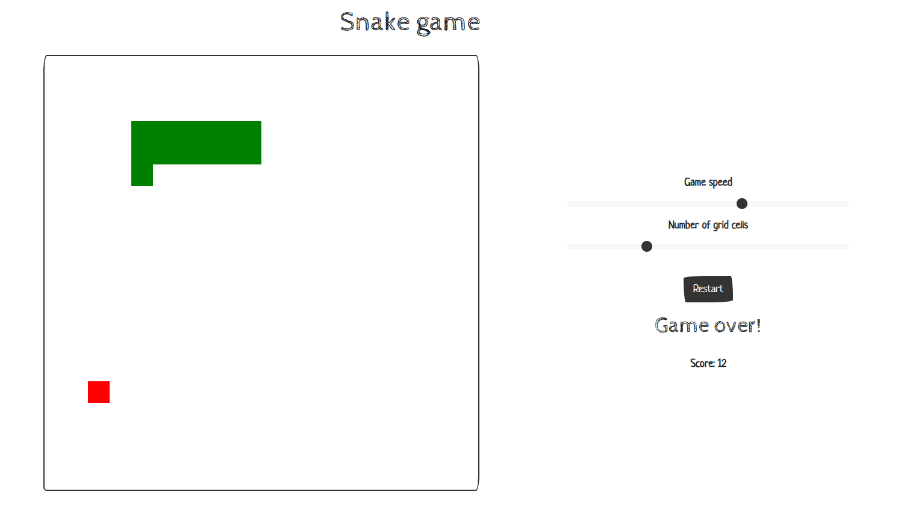

# React snake
This is an implementation of classic [Snake](https://en.wikipedia.org/wiki/Snake_(video_game_genre)) game using [React.js](https://react.dev/) library.

## Dependencies
- [Node.js](https://nodejs.org/en) runtime environment
- [Vite.js](https://v2.vitejs.dev/) development server
All the project-specific dependencies are listed in `package.json` file. They can be installed using Node package manager (running `npm install` in the root directory of the project).

## Execution
Currently, the application is not deployed, thus, there are no transpiled JS files available. The application can be run using Vite development server (running `npm run dev` in the root directory of the project) and then connecting to the server from the web browser.

## Functionality description
The rules of the game follow the original ones. To control the snake, the arrow keys are used. Currently, there are two parameters that can be configured:
- Game speed
- Size of the board

Before the start of the new game, there is a 3 second countdown.
